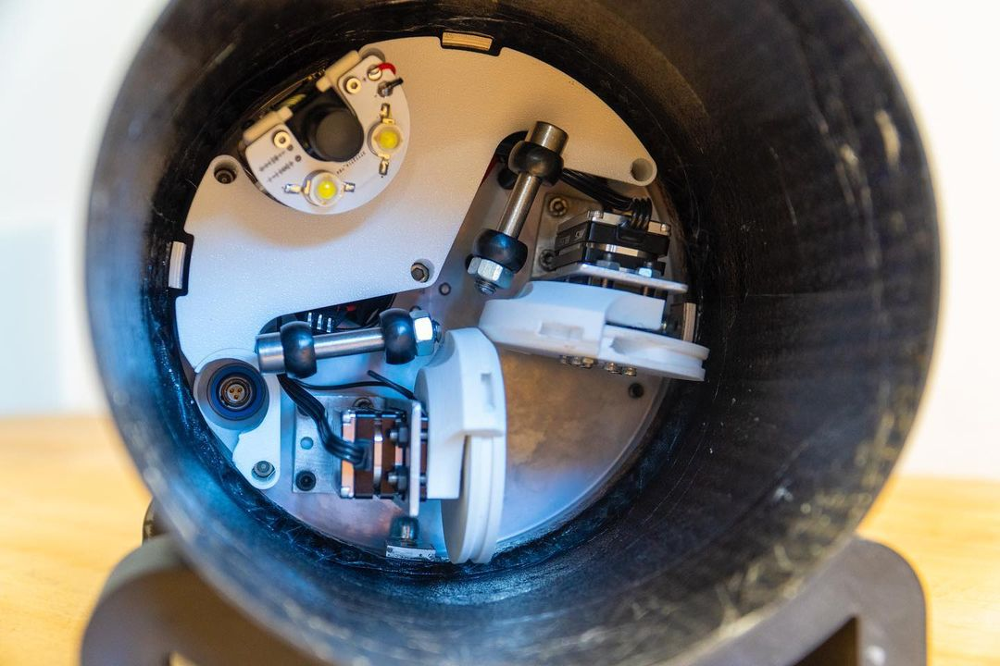

% What does rocketry look like?
% Jasper Day
% 2022/10/28

# EPFL (Presentation)

# EPFL (Sliding payload sections)

# Aris Space (Linear Airbrakes)

# Presentation Again

# Bath (Canards)

# Cool Paint Jobs (Baltasar)

# Bulkheads from Skyward

# Recovery deployment from Skyward

# Skyward Payload

# Guided Recovery

# Skyward Avionics

# Skyward Avionics II

# ICLR's Hybrid

# Supersonic CFD

# Skyward helicopter drop test

# CranSEDS 2-Stage Launch

# Skyward Launch I

# Skyward Launch II

# Skyward Recovery

